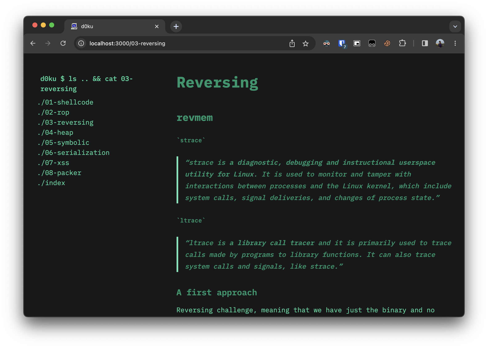

# D0ku

This is a [Next.js](https://nextjs.org/) project bootstrapped with [`create-next-app`](https://github.com/vercel/next.js/tree/canary/packages/create-next-app).

The idea is to create a simple, easy to use, and easy to deploy wiki. The wiki is designed to be used by a small group of people, and is not intended to be a public resource.

The backend is deployed via a simple OOP Express server, while the fronted consists of a NextJS + TailwindCSS application. At the current state, the application is not ready for production use, and it looks like this:



## Getting Started

First of all you need to follow those steps:
1. Add some source markdown files to the `./docs` folder. You must add a `index.md` file which will represent the homepage of your wiki.
2. Now you need to define a title for your project by editing the `metadata` object located at `./src/app/layout.tsx`.

Now you need to install dependencies (`$ npm i`) and run the backend server:

``` bash
npx tsc backend/app.ts --esModuleInterop && node backend/app.js
```

Then, run the development server:


```bash
npm run dev --turbo
```

Open [http://localhost:3000](http://localhost:3000) with your browser to see the result.


This project uses [`next/font`](https://nextjs.org/docs/basic-features/font-optimization) to automatically optimize and load Inter, a custom Google Font.
